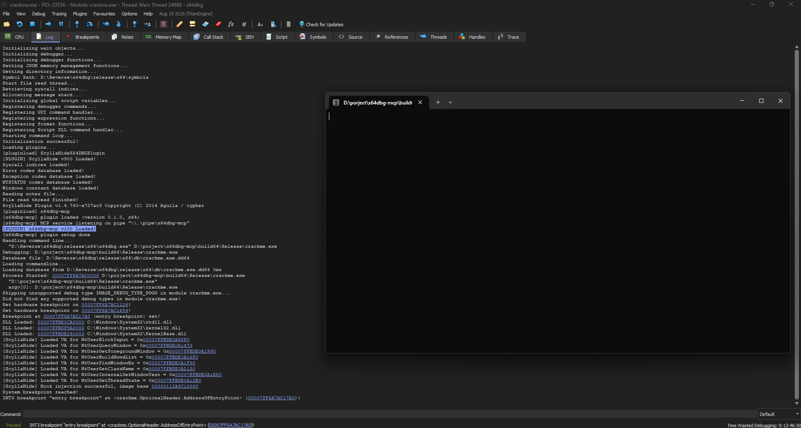

# x64dbg-mcp

An MCP server for the [x64dbg](https://x64dbg.com/) debugger. It gives an AI agent access to live debugging and reverse engineering: inspecting process state, reading memory, disassembling code, controlling execution, and managing breakpoints.


<!-- TODO: add docs/images/screenshot.png -->

## What it can do

- Inspect the debugger state: whether a session exists, running or paused, process and thread IDs, pointer size, current instruction pointer.
- Read raw memory and disassemble instructions, both with human-readable formatting.
- Control execution: run, pause, stop, restart, run to an address, and step into/over/out.
- Set, manage, and list breakpoints, software, hardware, and memory, with conditions and logging.
- List loaded modules and report a module sections, exports, and imports.
- Report the process memory map and enumerate its threads.

## Example

A real exchange between an agent and x64dbg-mcp while looking at a crackme.

`debugger_status`:

```
Debugging: process is paused (PID 21788, TID 31068, 64-bit) at 0x7ff6a7ac17a0 in crackme.
```

`disassemble`:

```
00007ff6a7ac17a0  4883ec28                  sub rsp,28
00007ff6a7ac17a4  e853020000                call crackme.7FF6A7AC19FC
00007ff6a7ac17a9  4883c428                  add rsp,28
00007ff6a7ac17ad  e972feffff                jmp crackme.7FF6A7AC1624
00007ff6a7ac17b2  cc                        int3
```

`read_memory`:

```
00007ff6a7ac17a0  48 83 ec 28 e8 53 02 00  00 48 83 c4 28 e9 72 fe  H..(.S...H..(.r.
00007ff6a7ac17b0  ff ff cc cc b9 02 00 00  00 cd 29 c3 48 83 ec 28  ..........).H..(
```

`set_breakpoint` followed by `debug_control` with action `run`:

```
Breakpoint set at 0x7ff6a7ac17a9 (software).
Paused (breakpoint) at 0x7ff6a7ac17a9 in crackme.
```

`module_info`:

```
crackme.exe  base=0x7ff6a7ac0000  size=0x28000  entry=0x7ff6a7ac17a0

Sections:
Address           Size        Name
0x7ff6a7ac1000    0x14b70     .text
0x7ff6a7ad6000    0xa7c4      .rdata
0x7ff6a7ae1000    0x1780      .data
```

From this listing alone, the model recognized the C runtime function prologue, the stack space reserved for the Win64 calling convention argument shadow space, a tail jump used instead of a return, and the `int3` filler bytes marking the end of the function, all without being told any of it.

## How it works

x64dbg-mcp is two processes talking over a named pipe:

```
MCP client (Claude Code / Claude Desktop)
        |  stdio, JSON-RPC 2.0
        v
x64dbg-mcp.exe            MCP server: schemas, limits, formatting
        |  named pipe (owner-only ACL)
        v
x64dbg-mcp.dp64           plugin inside x64dbg.exe
        |  queue -> single worker thread
        v
x64dbg SDK
```

Two processes instead of one because the MCP stdio transport requires the client to launch the server as its own child process, while x64dbg is opened directly by the user, not by the MCP client. Splitting the server out also means that parsing data coming from the model happens outside the debugger process, so a bug there cannot bring the debugging session down with it. See `docs/adr/0001-architecture.md` for the full rationale.

## Installation

1. Download a build, or build it from source (see below).
2. Copy `x64dbg-mcp.dp64` into the `plugins` folder next to `x64dbg.exe` (for the 32-bit debugger, copy `x64dbg-mcp.dp32` into the `plugins` folder next to `x32dbg.exe`).
3. Put `x64dbg-mcp.exe` anywhere.
4. Add the server to the MCP client configuration.

Claude Desktop (`claude_desktop_config.json`):

```json
{
  "mcpServers": {
    "x64dbg": {
      "command": "C:\\path\\to\\x64dbg-mcp.exe"
    }
  }
}
```

Claude Code:

```
claude mcp add x64dbg -- C:\path\to\x64dbg-mcp.exe
```

The server can be started before x64dbg: the connection to the plugin is established on the first tool call, and if the debugger is restarted, the server reconnects on its own.

## Tools

| Tool | What it does |
|---|---|
| `server_status` | Reports whether the server is connected to the x64dbg plugin. |
| `debugger_status` | Reports whether a debugging session exists, running or paused, PID/TID, pointer size, current instruction pointer, and module. |
| `read_memory` | Reads raw bytes from the debuggee memory, up to 1 MiB per call, with a hex dump. |
| `disassemble` | Disassembles up to 256 instructions starting at an address, with symbols already resolved. |
| `debug_control` | Runs, pauses, stops, restarts the debuggee, or runs to a chosen address. |
| `step` | Steps into, over, or out of the current instruction, one or many steps per call. |
| `wait_until_paused` | Waits for the debuggee to reach a paused state. |
| `set_breakpoint` | Sets a software, hardware, or memory breakpoint, optionally conditional or logging. |
| `manage_breakpoint` | Deletes, enables, or disables an existing breakpoint. |
| `list_breakpoints` | Lists every breakpoint with its type, state, hit count, and name. |
| `list_modules` | Lists loaded modules with base address, size, entry point, and path. |
| `module_info` | Reports a module sections and, on request, its export and import tables. |
| `memory_map` | Reports the process memory map: regions, state, type, and access protection. |
| `list_threads` | Lists the debuggee threads with their state and which one is current. |

## Security and risks

This server gives the model full access to the debugger: reading memory, controlling execution, and setting breakpoints, with writing memory and running arbitrary x64dbg commands planned for later. Please read this before pointing it at anything important:

- Only debug code you are prepared to lose, and preferably do it in an isolated environment: the debuggee actually runs, it is not simulated.
- The named pipe is restricted to the owner of the session and the system; remote connections are rejected.
- The model can make mistakes. It can pause, modify, or terminate the debugged process.
- Responsibility for what is being debugged rests with the user, not the tool.

## Building from source

Requires Visual Studio 2022 or newer and CMake 3.19+. The x64dbg SDK is downloaded automatically at configure time and verified against a checksum; there is nothing to install by hand.

```
cmake -B build64 -A x64
cmake --build build64 --config Release
```

For a 32-bit build, use `-A Win32` instead. The build produces `build64\Release\x64dbg-mcp.dp64` and `build64\Release\x64dbg-mcp.exe`.

Tests:

```
ctest --test-dir build64 -C Release --output-on-failure
```

The C runtime is linked statically, so there is nothing extra to redistribute alongside the built binaries.

## Development and verification

`tests/target/crackme.c` is a small target program used for manual verification of the MCP tools. It is built with `-DX64DBG_MCP_BUILD_TARGET=ON` and prints its own reference addresses (PID, module base, key target addresses) on startup, so a tool answer can be checked against known-correct values instead of just looking plausible. See `tests/target/README.md` for the full list of targets and how to check each one.

## Troubleshooting

| Symptom | Cause | What to do |
|---|---|---|
| Tools report that x64dbg is not running | The plugin is not loaded, or the debugger is closed | Check `server_status`, confirm the plugin file is in `plugins`, and look for a load message in the x64dbg log |
| Multiple x64dbg instances running | The pipe name is taken; the second plugin picks a name that includes its process ID and logs it | Pass that name to the server with `--pipe <name>` |
| The client sees no tools | The server did not start | Run `x64dbg-mcp.exe --help` by hand and check its stderr output |
| Need a detailed log | | Pass `--log-level debug`; the log is written to stderr |

## Limitations

Not implemented yet: writing to or patching memory, running arbitrary x64dbg commands or scripts, execution tracing and code coverage, reading registers and the call stack, byte-pattern signature search, cross-references, and MCP resources. These are planned; see `docs/tools.md` for the full roadmap.

## License

MIT, see `LICENSE`. Third-party licenses are listed in `THIRD_PARTY_LICENSES.md`. The x64dbg SDK is not bundled in this repository; it is downloaded during the build.
